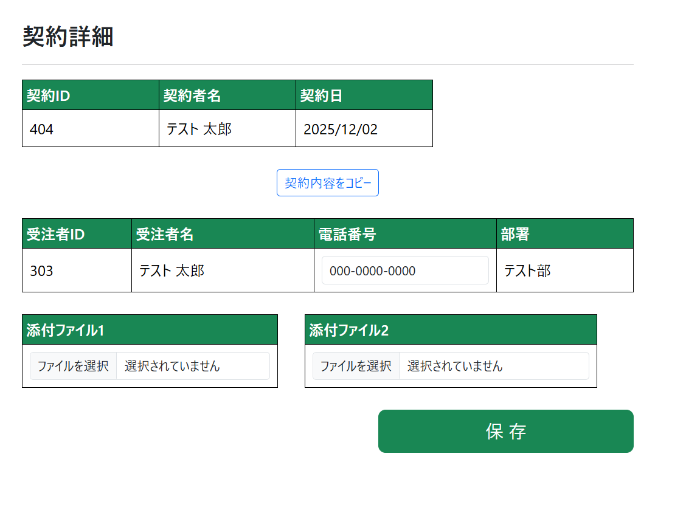
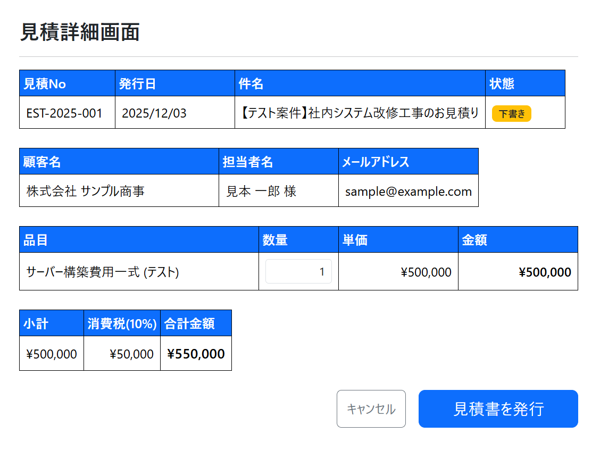
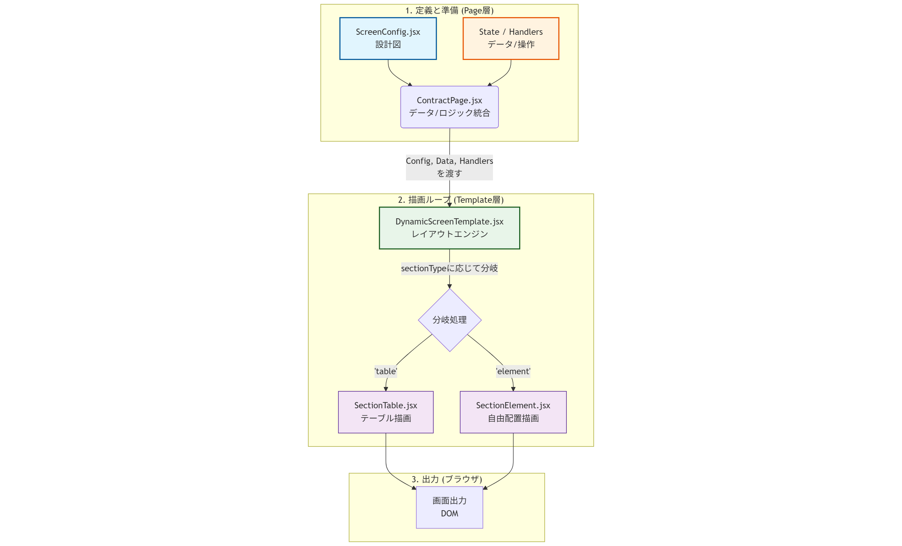

# react-config-driven-ui-starter

|  完成図 1：契約詳細画面 (緑)   |       完成図 2：見積詳細画面 (青)       |
| :----------------------------: | :-------------------------------------: |
|  |  |

設定ファイル（Config）ベースで UI を動的に生成する、React フォーム/テーブル構築アーキテクチャです。
Atomic Design を採用し、「見た目（Template/Organism）」と「ロジック（Page）」を完全に分離することで、高い保守性と拡張性を実現しています。

## 特徴

- **No Hardcoding**: 画面のレイアウトや項目を JSX に直書きせず、設定ファイル（Config）で管理。
- **Atomic Design**: コンポーネントの責務を明確化（Page -> Template -> Organism）。
- **Flexible Elements**: テキスト表示だけでなく、Input、File、ボタン、バッジなど任意の React Element を配置可能。
- **Dependency Injection**: イベントハンドラや State を Page 層から注入するため、コンポーネントはピュアな状態を維持。
- **Styling**: React Bootstrap をベースに、Config からスタイルやクラスの微調整が可能。

## 技術スタック

- **Framework**: React (Create React App)
- **UI Library**: React Bootstrap (Bootstrap 5)
- **Language**: JavaScript (JSX)

## アーキテクチャの仕組み

このフレームワークは、**「設定ファイル(Config)」を「テンプレート(Template)」が読み解き、適切な「部品(Organism)」を配置する** という流れで画面を描画します。

データとロジックは Page 層で管理され、Template を経由して末端の UI 部品に注入されます。



### 処理の流れ

1.  **定義と準備**
    - `Page` コンポーネントが、画面の設計図である `Config` を読み込みます。
    - 同時に、表示するデータ (`State`) や操作時の関数 (`Handlers`) を準備します。
2.  **描画ループ**
    - `Page` から全てを受け取った `Template` は、Config の配列をループ処理します。
    - 各セクションの `sectionType` ('table' か 'element' か) を見て、適切な `Organism`（コンポーネント）を呼び出します。
3.  **出力**
    - 選ばれた `Organism` が、渡されたデータを使って最終的な HTML(DOM)を生成し、ブラウザに表示します。

## ディレクトリ構成

Atomic Design に基づき、以下のように責務を分離しています。

```text
src/
├── components/
│   ├── organisms/
│   │   ├── SectionTable.jsx    # テーブルセクション描画（項目リスト）
│   │   └── SectionElement.jsx  # 汎用エレメント描画（ボタン、フリーエリア）
│   └── templates/
│       └── DynamicScreenTemplate.jsx # 画面全体のレイアウト構造
├── config/
│   └── ScreenConfig.jsx        # 画面ごとのUI定義（設計図）
├── pages/
│   └── ContractPage.jsx        # データ管理・ロジック定義・ハンドラ注入
└── App.js
```

## 使い方 (新しい画面の追加方法)

新しい画面（例: 見積詳細）を追加する際は、以下の手順で行います。

### 1. Config ファイルの作成

`src/config/EstimateConfig.jsx` を作成し、画面構成を定義します。
※ JSX を含むため、拡張子は `.jsx` を推奨します。

```jsx
import { Form, Button } from "react-bootstrap";

export const estimateLayoutConfig = [
  // テーブルセクション
  {
    id: "basic_info",
    sectionType: "table",
    headerVariant: "primary",
    fields: [
      { key: "id", label: "見積No", type: "text" },
      // Inputを表示する場合 (データバインディング対応)
      {
        key: "amount",
        label: "金額",
        type: "element",
        element: (data, handlers) => (
          <Form.Control
            value={data.amount}
            onChange={handlers.onAmountChange}
          />
        ),
      },
    ],
  },
  // ボタンセクション (エレメント)
  {
    id: "submit_area",
    sectionType: "element",
    element: (data, handlers) => (
      <div className="text-end">
        <Button onClick={handlers.onSave}>保存する</Button>
      </div>
    ),
  },
];
```

### 2. Page コンポーネントの作成

`src/pages/EstimatePage.jsx` を作成し、データとロジックを定義してテンプレートに渡します。

```jsx
import React, { useState } from "react";
import { estimateLayoutConfig } from "../config/EstimateConfig.jsx";
import DynamicScreenTemplate from "../components/templates/DynamicScreenTemplate";

const EstimatePage = () => {
  // State管理
  const [data, setData] = useState({ id: "E001", amount: 10000 });

  // ロジック定義
  const handlers = {
    onAmountChange: (e) => setData({ ...data, amount: e.target.value }),
    onSave: () => console.log("Saved:", data),
  };

  return (
    <DynamicScreenTemplate
      title="見積詳細画面"
      config={estimateLayoutConfig}
      data={data}
      handlers={handlers}
    />
  );
};

export default EstimatePage;
```

---

## Configuration リファレンス

### セクション設定 (`sectionType`)

| プロパティ      | 値                            | 説明                                               |
| :-------------- | :---------------------------- | :------------------------------------------------- |
| `sectionType`   | `'table'`                     | ラベルと値が並ぶテーブル形式のセクション。         |
| `sectionType`   | `'element'`                   | ボタン群やフリーレイアウトを表示するセクション。   |
| `headerVariant` | `'success'`, `'primary'` etc. | (Table のみ) ヘッダーの背景色 (Bootstrap カラー)。 |

### フィールド設定 (`fields` 配列内)

| プロパティ    | 値                  | 説明                                                                  |
| :------------ | :------------------ | :-------------------------------------------------------------------- |
| `label`       | `string`            | ヘッダーに表示する項目名。                                            |
| `key`         | `string`            | `data` オブジェクトから値を参照するためのキー。                       |
| `type`        | `'text'`            | 単純なテキストとしてデータを表示。                                    |
| `type`        | `'element'`         | `element` プロパティで定義した JSX を表示。                           |
| `type`        | `'spacer'`          | 透明な隙間を作る（セルの結合解除）。                                  |
| `element`     | `JSX` or `Function` | 表示するコンポーネント。関数の場合 `(data, handlers) => JSX` となる。 |
| `headerStyle` | `object`            | ヘッダーセル(`th`)へのスタイル (`width`等はここに記述)。              |

---

## インストールと実行

Create React App を使用しているため、以下のコマンドで実行します。

```bash
# パッケージのインストール
npm install

# 開発サーバーの起動 (Create React App)
npm start

# 本番ビルド
npm run build
```

---

### 採用のメリット

- **仕様変更への強さ**: 「項目の順番入れ替え」「ラベル変更」「非表示化」などが、ロジックに触れることなく Config の修正のみで完結します。
- **デザイン統一**: 全画面で共通のテンプレートを使用するため、画面ごとのレイアウト揺れ（余白や色味の違い）が発生しません。
- **並行開発**: 「画面設計（Config を作る人）」と「ロジック実装（Page を作る人）」で作業分担が可能です。

## 留意点と適用範囲

このアーキテクチャは「管理画面の生産性」に特化しているため、すべてのユースケースに適しているわけではありません。以下の特性を理解して採用してください。

### ✅ 向いているケース

- **管理画面・ダッシュボード**: 項目が規則的に並ぶ画面。
- **CRUD 画面**: データの一覧表示、登録、編集画面。
- **頻繁な仕様変更**: ラベル文言や項目の並び順がよく変わるプロジェクト。

### ❌ 向いていないケース

- **複雑なインタラクション**: 項目間の複雑な依存関係（A を選択したら B の選択肢が API 経由で変わる等）が多い場合。
  - _対策: その部分だけ `handlers` で制御するか、Config を使わず通常のコンポーネント実装を行います。_
- **デザイン重視の画面**: LP や、要素が不規則に配置される画面。
  - _対策: このフレームワークは使用せず、通常の JSX で実装することを推奨します。_
